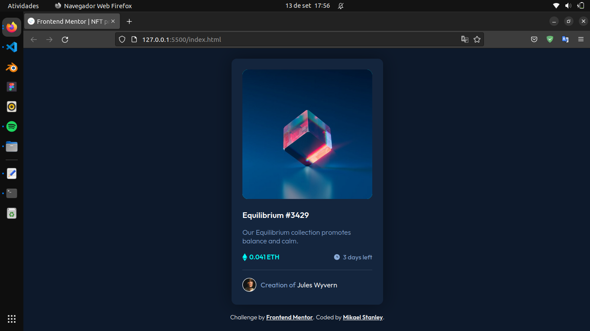

# Frontend Mentor - NFT preview card component solution

This is a solution to the [NFT preview card component challenge on Frontend Mentor](https://www.frontendmentor.io/challenges/nft-preview-card-component-SbdUL_w0U). Frontend Mentor challenges help you improve your coding skills by building realistic projects. 

## Table of contents

- [Overview](#overview)
  - [The challenge](#the-challenge)
  - [Screenshot](#screenshot)
  - [Links](#links)
- [My process](#my-process)
  - [Built with](#built-with)
  - [Development](#development)
- [Author](#author)

## Overview

### The challenge

Users should be able to:

- View the optimal layout depending on their device's screen size
- See hover states for interactive elements

### Screenshot

### Links

- Solution URL: 
- Live Site URL: 

## My process

### Built with

- HTML5
- CSS properties
- Flexbox

### Development

First I separated each important element into **div** tags, to facilitate the organization and stylization of the card, so I could separate each one in a way that they could not affect other elements, such as tags for titles, paragraphs or images. So I grouped each element, started editing the CSS file, for starters, I stored each needed color in a variable, using the **:root** pseudo-class, I also reset the margin and page padding to zero. With everything defined, I started to style the card, to make it easier to visualize in the browser, I styled the border of each group, then I started to define the margin, size and position of each element on the card. With the elements in their defined positions and sizes, I defined their colors, for the background and for the texts. Finally, I started defining the interaction with the elements, defining a **:hover** property for each element.

## Author

- Frontend Mentor - [@mikaelStl](https://www.frontendmentor.io/profile/mikaelStl)
